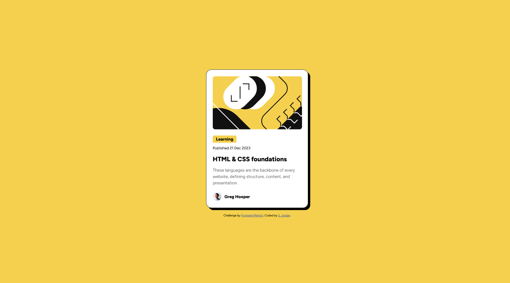

# Frontend Mentor - Blog preview card solution

This is a solution to the [Blog preview card challenge on Frontend Mentor](https://www.frontendmentor.io/challenges/blog-preview-card-ckPaj01IcS). Frontend Mentor challenges help you improve your coding skills by building realistic projects. 

## Table of contents

- [Overview](#overview)
  - [The challenge](#the-challenge)
  - [Screenshot](#screenshot)
  - [Links](#links)
- [My process](#my-process)
  - [Built with](#built-with)
  - [What I learned](#what-i-learned)
  - [Continued development](#continued-development)
  - [Useful resources](#useful-resources)
- [Author](#author)
- [Acknowledgments](#acknowledgments)

## Overview

### The challenge

Users should be able to:

- See hover and focus states for all interactive elements on the page

### Screenshot

### Links

- Solution URL: [Add solution URL here](https://your-solution-url.com)
- Live Site URL: [Add live site URL here](https://your-live-site-url.com)

## My process

### Built with

- Semantic HTML5 markup
- CSS custom properties
- Flexbox

### What I learned

I brushed up on CSS variables and using local fonts.

### Useful resources

- [Example resource 1](https://stackoverflow.com/questions/38086083/to-use-local-font-in-html-using-font-face) - This helped me with the syntax of loading a locally stored custom font into the page.
- [Example resource 2](https://css-tricks.com/snippets/css/a-guide-to-flexbox/) - Flexbox cheatsheet reference that I always keep handy just in case.

## Author

- Website - [Steph Jordan](https://jordanmakes.com)
- Frontend Mentor - [@curricle](https://www.frontendmentor.io/profile/curricle)